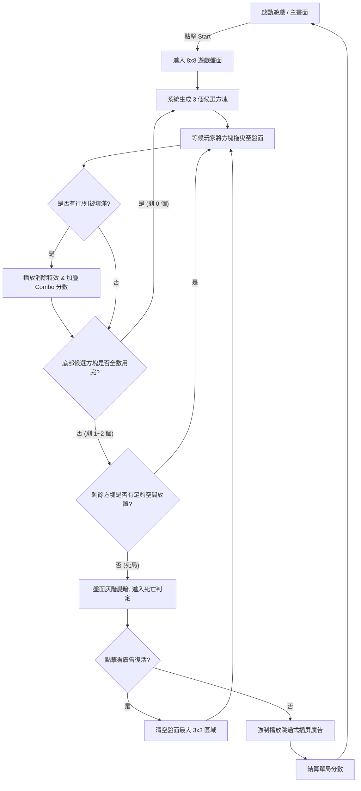
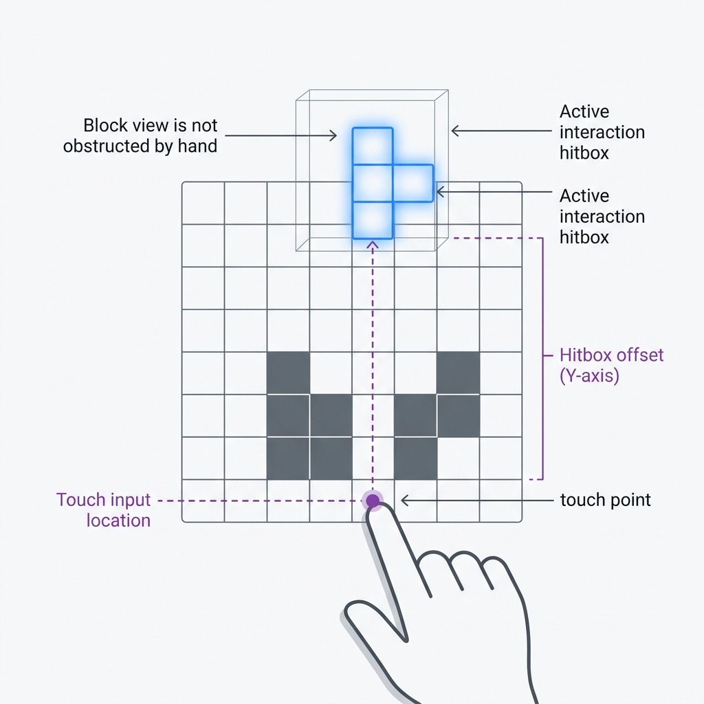

# Block Blast! 規格書 - 01. 系統與經濟拆解
> 分析基礎：無盡方塊消除玩法 (10x10 或 8x8 混合棋盤)
> 負責人：Game Designer AI

## 1. 核心玩法概要 (Gameplay Overview)
- **盤面基底**：遊戲在固定的 8x8 網格盤面上進行。
- **基礎行為**：每次系統會在畫面底部提供 3 個不同形狀的方塊模塊（類似俄羅斯方塊）。玩家透過拖曳將其放置於盤面空白處，不限制這 3 個方塊的擺放順序。
- **消除規則**：當方塊填滿任意一整「橫行」或一整「直列」時，該行/列會立刻消除並騰出網格空間。
- **推進機制**：底部的 3 個方塊必須「全數擺放至盤面上」後，系統才會刷新下一批全新的 3 個候選方塊。
- **勝敗條件**：遊戲為無盡挑戰（純分數制無破關區分）；當底部剩餘的任何一個方塊，因盤面空間不足而「在任何位置皆無法放置」時，即觸發失敗（Game Over）。

## 2. 遊戲核心與外圍流程 (Game Flow)
本流程圖對應至規格書中的 **`流程圖`** 分頁，明確定義單局生命週期與系統跳轉邏輯：

## 3. 操作邊界與極限反饋（0-30秒）
### 3.1 輸入/輸出映射與防呆 (Hitbox)

- **觸控判定偏移區 (Hitbox Offset)**: 玩家點擊底部三個候選方塊時，方塊生成/懸浮位置並非「指尖正下方」，而是**被強制推算至手指觸控點上方約 30-50px 的位置**，確保玩家視線不會被自己的手指遮擋（休閒遊戲極重要的防呆設計）。
- **網格吸附 (Snap to Grid) 寬容度**：將方塊拖曳至盤面時，無須完美對齊。當方塊的中心點與目標網格的偏移量 < 40% 且下方無遮擋，放開手指系統會自動吸附就位。
- **拒絕放置與復位**：若拖曳的方塊在盤面上無法放置（與既有方塊重疊），或是玩家手動滑動回底部候選區放開，方塊會快速 Tween (約 0.15s) 飛回原位。
- **並發輸入處理 (Concurrency)**：遊戲不支援兩指同時拖拉多個方塊，底層強制為單執行緒輸入；若於消除動畫播放途中丟入新方塊，採用「指令佇列 (Queue)」處理，視覺上即時響應擺放，但在計算邏輯上會等待上一波消除結算完畢，再判定並發的 Combo。

### 3.2 單次行動反饋
- **置入反饋**：成功放置方塊，伴隨「喀」音效與極短落實震動（Haptic feedback < 10ms），接觸格會有短暫的微小彈性縮放動畫 (1.05x -> 1.0x, 持續 0.1s)，以提供著陸的重量感。
- **消除反饋**：達成整行/列連線瞬間，全排發光高亮並播放方塊碎裂特效。隨後觸發計分浮現與 Combo 計數器 UI 跳動。

## 4. 單局目標層次與留存鉤子（5-15分鐘）
### 4.1 目標與失敗判定
- **即時通關目標**：盡可能消除以獲得高分（純無盡模式），無過關概念。
- **次要局內目標**：追求 Combo 不斷點（連續擺放都有達成消除），以及活動後設道具的收集（不定時出現在特定格子上，必須消掉該行/列才能收集破冰）。
- **極限失敗定義 (Game Over)**：當底部 3 個候選方塊中，有「任意一個」在當前盤面上**從左上至右下遍歷運算都完全找不到合法空位**時，系統判定為「無解死局」。不再讓玩家拖曳，直接觸發死亡流程，盤面上所有格子變暗。

### 4.2 RNG 隨機控制與 DDA（系統放水機制）
- **高強度的偽隨機生成演算法 (Pseudo-RNG)**：
  - **開局放水 (DDA 增益)**：每局重新開始的前 10 次生成的候選方塊，嚴格排除高難度的 3x3 巨型方塊或 5格長條，強制以極簡的 1x1 到 3格 L 型為主，確保開局心流。
  - **死局救援機制 (Pity System)**：當盤面空餘格數 < 25% 且玩家無消除空間時，系統有高機率（實測約 60%）會在下一次刷新的 3 個磚塊中，給予至少 1 個剛好能消除一行/列的保命磚塊 (如 1x1)。
  - **極限殺戮機制**：若玩家單局存活時間過長（如超過 15 分鐘），系統會明顯增加高卡位磚塊（如大 3x3 或大型十字）的生成機率，強行壓低容錯率以終結單局，轉換廣告庫存。

### 4.3 接關與心流中斷
- **中斷延遲**：判定死亡瞬間，畫面不會立刻跳出結算或播廣告，而是擁有約 2.5 秒的「後悔時間」(視覺由外圍向內緩慢變暗)，給予足夠心理壓迫感。
- **復活誘因**：畫面中心跳出**「看廣告復活 (Free Revive)」**大按鈕。玩家觀看後，系統會自動清除盤面上一個最大堆疊的隨機 3x3 區域（或消除最密集兩行），保留分數讓玩家繼續 Combo。

## 5. 逆向經濟與數值控制模型
### 5.1 核心經濟特徵
- 主玩法完全沒有「血量」、「體力限制」或「過關金幣」，徹底依賴純粹的心流與排行榜分數炫耀來驅動。
- **付費點孤島化**：無 RPG 式累加數值或天賦樹。只有單純的分數。

### 5.2 得分與 Combo 數學公式推導
- **基礎消除**：消去單一 行/列 獲得 10 分。
- **多行係數**：同時消除 2 行給 30 分，3 行 60 分，4 行 100 分（呈指數上升，誘使玩家在此堆疊尋求高風險高報酬）。
- **Combo 倍乘公式**：若連續兩次放置都存在行/列消除，進入連擊。
  - Combo N 分數獎勵 = `基礎得分 + (N-1) * 10`
  - 並伴隨視覺文字放大（Great! -> Amazing! -> Unbelievable!）。這導致中後期的分差全仰賴 Combo 疊加，倒逼玩家必須改變「立刻消」的保守策略，轉向「堆滿再消」的賭徒決策。

## 6. 廣告與 IAP 商業化節點
- **Banner 廣告**：常駐於畫面最底部（候選方塊區下方）。
- **插屏廣告 (Interstitial)**：每一次 Game Over，當玩家選擇[放棄復活]或是[復活後二次死亡]結算後，強制彈出 5~15 秒的可跳過插屏廣告。
- **付費牆設計**：無體力牆，遊戲內唯一的 IAP 付費錨點為 "$2.99 去除廣告 (Remove Ads)"。是一款將休閒度拉滿、純粹透過「堆疊快速局數以最大化曝光插屏廣告」的 DAU 變現怪物產品。
