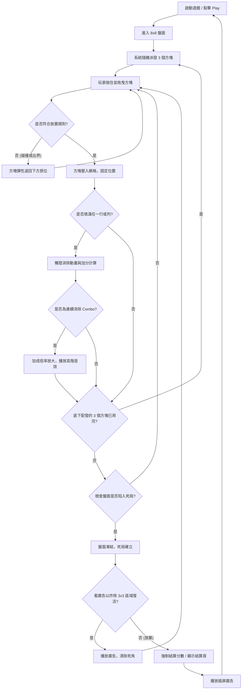

# Block Blast 規格書 - 01. 系統與經濟拆解
> 分析基礎：空間堆疊演算與死亡邊界經濟學
> 負責人：Game Designer AI

## 1. 核心玩法概要 (Gameplay Overview)
- **盤面基底**：一個 8x8 的微縮正方形烤盤，下方有三個被固定的碎塊配發槽。
- **基礎行為**：點擊並按住配發槽的其中一個方塊，拖曳至 8x8 烤盤。方塊一旦放開，將立刻被固定入網格，不可移動與重置。
- **物理容積限制**：盤面總空間為 64 格，當 3 個方塊全數消耗完畢後，系統才會再次派發 3 個隨機方塊。
- **轉移規則**：方塊只能放置於「完全空白且無重疊」的區域，且不得超出 8x8 邊界。
- **勝敗條件**：
  - **勝利**：無明確過關勝利。目標為無上限累積消除分數 (High Score)。
  - **失敗/死局**：當前盤面的剩餘連續空白空間，無法容納底部配發槽中「任一」待定方塊的形狀時，即判定為無法操作的死局。

## 2. 遊戲核心與外圍流程 (Game Flow)
本流程圖對應至規格書中的 **`流程圖`** 分頁，明確定義單局生命週期與系統跳轉邏輯：

## 3. 操作邊界與極限反饋（0-30秒）
### 3.1 輸入/輸出映射與防呆 (Hitbox)
- **手指遮蔽補償 (Y-Axis Offset)**：拖曳物件時，實體模型強制往 Y 軸上方平移 150px，確保大拇指在螢幕滑動時不會遮擋到玩家的視線焦點，降低誤判率。
- **懸浮投射預覽 (Ghost Drop)**：觸發懸停時，底層網格發出預覽光芒，明確指示鬆手後的落點。
- **反悔防呆機制**：拖曳到一半若不想放手，只要將方塊滑回配發槽或是屏幕邊緣的紅色無效區鬆手，方塊就會如同被橡皮筋拉回般安全歸位。

### 3.2 單次行動反饋
- **視覺與聽覺**：結合彈性縮放 (Squash & Stretch) 的入槽動畫，加上極具實體質感的木塊敲擊聲。
- **瞬時響應**：放手即落子，沒有過多的確認按鈕，拖曳與釋放的迴圈控制在 0.5 秒左右，製造「極速疊加」的爽快心流。

## 4. 單局目標層次與留存鉤子（5-15分鐘）
### 4.1 目標與難度生成
- **核心解謎依賴**：單純的二維空間填補 (Packing Problem)。玩家大腦必須不斷進行圖形旋轉與網格計算。
- **難度生成公式 (DDA)**：系統根據盤面殘餘空位進行馬可夫鏈崩潰預測。空間小於 9 格時，強制配發救命單格 (Pity Spawn)；當分數超出歷史高標，則強迫派發 3x3 大型障礙物 (Kill Switch) 收網。

### 4.2 死局與心流中斷
- 當死亡降臨時，遊戲畫面會強制「凍結」數秒，讓玩家看清楚因為哪個致命方塊放錯位置才導致無法挽回。
- **強烈的挫折變現點**：此時彈出的「看廣告復活並清理死角」的交易，成為利用玩家錯覺（我下次一定能排好）的最佳轉換節點。

## 5. 逆向經濟與數值控制模型
### 5.1 核心經濟循環 (Sources & Sinks)
- **純心理籌碼**：放棄傳統金幣模型，唯一產出與消耗的資源是「玩家對 High Score 的虛榮心與挫敗感」。這大幅降低了通貨膨脹或數值崩潰的風險。

### 5.2 復活體系與定價暗流
- **3x3 空間淨化器 (Blast Revive)**：
  - **定價策略**：這項最高段的救命機制完全無法透過遊玩取得，被嚴格鎖定在「觀看 30 秒高單價激勵廣告」後方，死死扣住變現的咽喉。

## 6. 廣告與 IAP 商業化節點
- **強插屏邏輯 (Interstitial)**：每次 Game Over 按下 Restart 開始新局的過場黑畫面，強插 5 秒短秒數廣告，將玩家的憤怒或懊悔轉換為等待冷卻。
- **去除廣告內購 (IAP)**：提供單次付費買斷方案，移除所有的干擾，專注提供最純粹無限的 ASMR 堆疊體驗。
