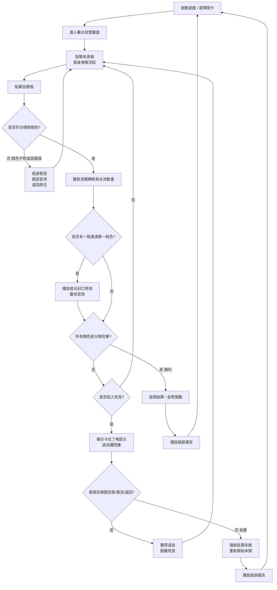

# Magic Sort 完整規格書 (GDD Full - 10 分頁對齊版)
> 分析基礎：《Magic Sort》公開影片、App Store 截圖、逆向玩法推測
> 負責人：Game Designer AI

---

## Tab 1 - 遊戲規則 (Game Rules)

### 核心操作定義
- **操作模式**：採用「二段式點擊」而非「拖曳 (Drag & Drop)」。先點擊來源瓶使其浮起選中，再點擊目標瓶完成傾倒。完全規避了手機螢幕邊緣拖曳容易斷觸的物理死穴。
- **取消選取防呆**：已選中浮起的瓶子，點擊空白處或再次點擊自身，即可平滑取消選中，不消耗任何負面數值，無懲罰設計。

### 物理容積限制
- 每個試管標準容積為 **4 單位液體**（4 層）。
- 傾倒時，必須確認目標試管的剩餘容積足夠承接來源試管的連續同色液體量。

### 轉移規則
- 液體**只能**倒入「顏色相同」的液體層上方，或「完全淨空」的試管中。
- 不可分次傾倒：一次傾倒會將來源試管最上層的**所有連續同色液體段**整批轉移。

### 勝敗條件
- **勝利**：所有試管要嘛全空，要嘛裝滿單一純色（4 單位）。
- **死局**：盤面無空瓶，且所有瓶子最頂層的顏色均無法互相匹配傾倒，玩家又用盡所有退回機會，即觸發無法操作的死局狀態。

### 容錯設計
- **撤銷 (Undo)**：每局提供 5 次免費使用額度；耗盡後需觀看廣告或花費金幣購買。
- **操作鎖定窗口**：液體傾倒動畫期間（約 0.4~0.6 秒），系統完全鎖定輸入，防止底層陣列資料與畫面渲染不一致。

### 操作極限邊界
- **Hitbox 膨脹**：試管可觸碰區域比視覺圖像大約 120%，降低誤觸率。
- **非拖曳設計的 Y 軸優勢**：因採二段式點擊而非拖曳，不需額外設計 Y 軸上移偏移（拇指遮擋問題由「不拖曳」的設計本身解決）。
- **自動完成 (Auto-Resolve)**：當盤面進入最後幾步必然的操作時，部分版本會觸發 Auto-Resolve，自動跑完動畫減少玩家垃圾時間。

---

## Tab 2 - 主題包裝 (Theme & Meta Story)

### 世界觀設定
- **表層主題**：魔法煉金工房 (Magic Alchemy)。普通科學試管被替換成帶有木塞的女巫燒瓶；彩色水添加了星光粒子變成「魔法藥水」；背景為溫馨的煉金書房。
- **皮相置換 (Reskinning) 的商業邏輯**：從 Water Sort 改版成 Magic Sort，是出於受眾擴張的純商業考量。魔法主題成功將目標受眾從硬核數獨解謎玩家，外溢到喜好 ASMR 感受的 25-45 歲女性玩家群體。

### 情感鉤子 (Emotional Hook)
- **整理與秩序**：核心玩法直接對應人類天生「歸類整理」的 OCD 式滿足感。
- **治癒感**：魔法泡泡藥水的純色分類成功後，瓶口蓋上的封口動畫配合清脆音效，提供強烈的「完成任務」多巴胺釋放。

### Meta 循環 (Renovation Meta)
- **敘事循環**：分類藥水推關（賺取魔法星星）→ 花費星星改造破舊煉金塔的家具（地毯、水晶球、掛畫）。
- **長期情感目標**：將短期的「枯燥數字過關」轉化為「把空盪殘破的房間整理得溫馨舒適」的長線情感投入，有效拔高 D7 / D30 留存率。

### 挫折敘事設計
- **死局乾瞪眼機制**：當玩家卡住無步可走，系統不立刻強制結算，而是讓玩家在無解盤面上乾瞪眼並思考道具的必要性，強化廣告轉換意願。
- **差點解開的 Pity System 幻覺**：系統在瀕死時暗中拉高救命道具出現的機率，製造「再一步就能解開」的英雄感幻覺。

---

## Tab 3 - 流程圖 (Game Flow)

---

## Tab 4 - 遊戲介面 (UI Layout)

### 主要面板（以 1080x2340 為基準座標系）
| 區域 | 位置 | 內容 |
| :--- | :--- | :--- |
| 頂部 HUD | Y: 0~200px | 關卡編號、分數、設定按鈕 |
| 核心盤面 | Y: 200~1800px | 試管排列陣列（主操作區） |
| 道具欄 | Y: 1800~2100px | Undo、+空瓶、重洗等道具快捷鈕 |
| 底部安全區 | Y: 2100~2340px | 保留空間，避免系統手勢衝突 |

### 觸控熱區 (Fitts's Law)
- 道具欄刻意放置於 Y 軸下方 1/3 區域（大拇指最易觸及的黃金操作帶）。
- 試管本體的 Hitbox 強制膨脹 120%，防止高頻點擊下的誤觸。

### HUD 資訊密度
- **常駐顯示**：關卡編號、已使用 Undo 次數。
- **隱藏不顯示**：廣告計數器、DDA 動態難度參數（玩家不可見）。

### 彈出層優先級
1. 死局道具廣告彈窗（最高層，Z=100）
2. 過關結算面板（Z=90）
3. 購買道具金幣確認框（Z=80）
4. 設定選單（Z=70）

---

## Tab 5 - 美術靜態開圖 (Static Art Specs)

### 主要物件素材列表
| 素材名稱 | 類型 | 建議輸出尺寸 | 備註 |
| :--- | :--- | :--- | :--- |
| 試管瓶身 (背板) | 9-Slice Sprite | 256x512px @3x | 暗色內框邊緣層 Z=0 |
| 液體色塊 | 填充 Polygon | 動態縮放 | 純實心色，絕對不透明 |
| 瓶身高光前壁 | Alpha Sprite | 256x512px @3x | 帶透明度的玻璃高光層 Z=2 |
| 背景底圖 | 靜態 2D 圖 | 1080x2340px @1x | 單張靜態圖，無層次 |
| UI 按鈕（道具） | Sprite Atlas | 128x128px @3x | 合批入同一圖集 |
| 結算面板背景 | 9-Slice Sprite | 960x600px @2x | 彈出層底圖 |

### 圖集 (Sprite Atlas) 策略
- 所有 UI 元件（按鈕、圖示、道具欄）合批入同一張 `ui_atlas.png`，控制 Draw Call 在 1 次以內。
- 試管液體色塊使用純色填充而非貼圖，Draw Call 成本幾乎為零。

---

## Tab 6 - 美術動態開圖 (Animation Specs)

### 核心物件動畫
| 動畫名稱 | 觸發條件 | 技術實作 | 時長 |
| :--- | :--- | :--- | :--- |
| 試管浮起 | 第一次點擊選中 | Scale X: 1.0 → 0.93 → 1.04 → 1.0 (貝茲曲線) | 0.15s |
| 液體傾倒 | 合法傾倒確認後 | UV Scrolling 帶狀貼圖 + 落水粒子 | 0.4~0.6s |
| 頂層水波 | 常駐 Idle | Vertex Shader Sine Wave（頂端頂點 Y 軸正弦晃動） | 循環 |
| 純色封口 | 湊滿單色觸發 | 發光 + 蓋子蓋上 + 星光爆散 | 0.8s |
| 錯誤搖頭 | 非法操作 | Shake (左右正弦位移，快速衰減) | 0.2s |

### 幀率保障
- 目標：**全機型 60fps**。
- Overdraw 層數控制：液體色塊全部使用不透明 (Opaque) 材質，嚴格限制 Overdraw ≤ 3 層。
- 粒子系統：封口爆散的星星粒子在落至畫面中段前，強制 Alpha 淡出消失，禁止開啟底層物理碰撞。

---

## Tab 7 - 道具功能 (Item / Power-up System)

| 道具名稱 | 取得方式 | 功能描述 | 使用限制 | 取得成本 |
| :--- | :--- | :--- | :--- | :--- |
| +1 空瓶 (Add Tube) | 看激勵廣告 | 新增一個空緩衝槽，大幅降低死局機率 | 每局最多 3 次 | 30 秒激勵廣告（無法以金幣購買） |
| 撤銷 (Undo) | 免費 / 金幣 | 撤銷上一次傾倒操作 | 每局 5 次免費 | 耗盡後每次消耗約 100 金幣 |
| 重洗 (Shuffle) | 金幣 / 道具格 | 重新隨機排列所有試管中的液體（保留顏色數量不變） | 每局限 1 次 | 約 300 金幣或看廣告 |

---

## Tab 8 - 機關物件 (Obstacle & Special Objects)

### 障礙類型（推測）
- 本體核心玩法無傳統「障礙物」設計，難度主要來自於**顏色數量的增加**（試管數量 10→14→18）與**可用空瓶數量的減少**（從 2 個減至 1 個）。

### DDA 連動
- **難度遞增公式**：關卡越高，系統在初始打亂 (Shuffle) 盤面時，使用更多步驟錯位，製造更難解開的初始狀態。
- **Pity System（瀕死保底）**：當玩家剩餘空間極少時，系統暗中提升下一步可操作的合法傾倒組合數量（偽 RNG 控制），避免玩家過早、在清醒認知下判斷死局並放棄遊戲。
- **Kill Switch（無）**：Magic Sort 關卡制設計無需 Kill Switch，不存在人為製造死局的卡點，廣告轉換主要依靠自然難度壓迫。

---

## Tab 9 - 美術風格資料 (Art Style Guide)

### 整體風格定調
- **擬物 3D 風格（輕量 Fake 3D）**：玻璃瓶採用烘焙高光欺騙眼睛，呈現 3D 質感，但底層為 2D Sprite 保持全機型高效能。

### 主色盤 (Color Palette)
| 用途 | 色彩描述 | 建議 HEX |
| :--- | :--- | :--- |
| 背景底圖 | 深色暖調木質感 | `#2D1B0E` |
| 試管瓶身高光 | 純白半透明玻璃感 | `#FFFFFF` @ 60% Alpha |
| 藥水色 - 紅 | 鮮豔寶石紅 | `#E83A3A` |
| 藥水色 - 藍 | 清透皇家藍 | `#3A7AE8` |
| 藥水色 - 綠 | 翡翠草綠 | `#3AE86A` |
| 危險提示 | 道具欄不足警示色 | `#FF6B00` |

### 光影系統
- **拒絕即時光影 (No Real-time Lighting)**：所有光效均為預先烘焙 (Baked Highlight) 的靜態高光貼圖，運行時等同 Unlit Shader，確保最低功耗。
- **玻璃假象（三明治圖層結構）**：
  1. Z=0（底層）：瓶子背部暗色內框。
  2. Z=1（中層）：不透明的各色液體色塊。
  3. Z=2（頂層）：帶 Alpha 透明度的純白玻璃高光前壁。

### 字體規格
- **主標題 / 關卡數字**：圓潤無襯線字體，Bold，主要顯示白色配深色描邊。
- **HUD 資訊**：Medium weight，黃金色或白色，直接貼於深色背景。

### 渲染策略
- Shader：Vertex Shader（頂端水波）+ Unlit Shader（液體色塊）。
- 材質壓縮：iOS 端 ASTC 6x6，Android 端 ETC2。

---

## Tab 10 - 音樂音效需求 (Audio Requirements)

### 背景音樂 (BGM)
- **風格**：溫馨輕盈的奇幻魔法風格，木琴或豎琴主旋律。
- **BPM**：約 90~110 BPM，維持輕鬆但略帶神秘的節奏感。
- **循環點設計**：淡入淡出在第 8 或第 16 拍的強拍換段，確保無縫 Loop。
- **情緒層次**：平常 → 逐漸緊張（試管接近滿載時）→ 過關勝利短旋律

### 核心音效 (SFX) 清單

| 事件 | 音效描述 | Pitch Shifting | 備註 |
| :--- | :--- | :--- | :--- |
| 試管選中浮起 | 輕微「波聲」或玻璃碰響 | 無 | 清脆短促 |
| 液體傾倒 | 高擬真度「倒水白噪音」 | 無 | ASMR 核心音效 |
| 液體層落定 | 輕軟液體拍打聲 | 無 | 搭配水位上升動畫 |
| 非法操作 | 短促低頻「叮」錯誤音 | 無 | 配合試管搖頭動畫 |
| 單色湊滿封口 | 清脆爆鳴 + 慶祝短旋律 | 每 Combo 連續封口 +0.5 音階爬升 | 多巴胺駭客核心 |
| 過關結算 | 完整 4~8 拍的勝利短旋律 | 無 | 情緒釋放高峰 |
| 死局觸發 | 低沉「嗡」或下滑音 | 無 | 配合乾瞪眼停頓畫面 |
| 使用道具 | 魔法粒子散開聲 | 無 | 正向情緒強化 |

### 記憶體預算
- **預估音訊資源總量**：≤ 15MB
- **壓縮格式**：背景音樂 AAC 128kbps；短 SFX 採 OGG Vorbis Q6。
- **Audio Occlusion**：不需要（2D 音效平面遊戲，無空間遮擋模擬需求）。
