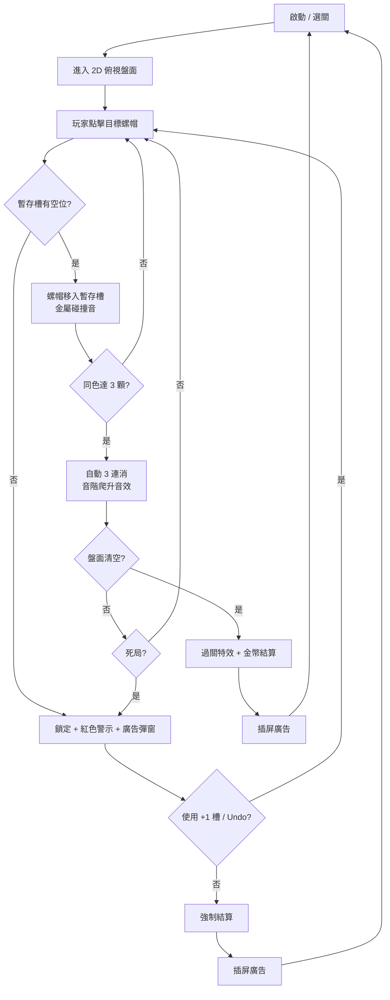

# SCREWCOLOR 規格書 - 01. 系統與經濟拆解
> 開發商：ABI GLOBAL LTD. / ABI Game Studio（越南）
> 分析基礎：App Store 截圖、玩法影片、逆向機制推測

## 1. 核心玩法概要
- **盤面基底**：2D 俯視視角，混色螺帽（Nut）平鋪於盤面，底部設有固定顏色收集盒。
- **操作模式**：單指點擊，螺帽移入「暫存槽（Temp Slots）」，槽內同色達 3 顆自動觸發消除飛入收集盒。
- **與競品關鍵差異**：自動 3 連消機制（非手動傾倒），壓力來源為暫存槽格子數，而非液體容積或 3D 拓撲。

## 2. 核心規則
- 螺帽只能移入顏色相同的收集盒（由系統自動配對）。
- 暫存槽有固定格子數（通常 5~7 格）。
- 所有格子滿載且無法形成 3 連消 = 死局。

## 3. 勝敗條件
- **勝利**：盤面所有螺帽清空。
- **失敗**：暫存槽滿載且無任何合法消除組合成立。

## 4. 核心流程圖

## 5. 道具體系
- **Undo**：每局 3 次免費，耗盡後看廣告。
- **+1 暫存槽**：最強道具，只能以激勵廣告換取（每局 2 次上限）。
- **清除指定色**：高階 IAP，直接清除盤面單一顏色全部螺帽。
- **洗盤 Shuffle**：約 300 金幣，重排盤面螺帽。

## 6. 廣告與商業化節點
- **強插屏**：每 1~2 關結算後強制插屏。
- **+1 槽廣告**：暫存槽滿載時彈出，轉換率為全局最高。
- **IAP 清除道具**：當玩家遇到顏色嚴重失衡的地獄關時，高單價 IAP 轉換率最高。

## 7. 競品三角位置
| 維度 | Magic Sort | Screwdom 3D | SCREWCOLOR |
| :--- | :--- | :--- | :--- |
| 空間維度 | 2D 試管垂直 | 3D 旋轉模型 | 2D 俯視盤面 |
| 消除觸發 | 手動湊滿 | 手動全拆完 | **自動 3 連消** |
| 核心壓力 | 試管容積 | 拓撲卡死 | 暫存槽格數 |
| Meta 深度 | 強（房間改造） | 弱 | 弱~中 |
