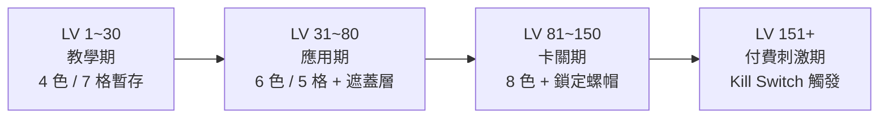

# SCREWCOLOR 規格書 - 02. 關卡與空間分析

## 1. 關卡節奏光譜



## 2. 難度生成邏輯
- 所有關卡由「已完成狀態」反向生成（保證絕對解存在）。
- **難度控制三維**：顏色種類數、暫存槽格子數、遮蓋 / 鎖定螺帽比例。
- **Kill Switch**：連過 4 關後系統派發「高塞滿率初始盤面」，主動製造死局触發 IAP。

## 3. 2D 盤面動線設計
- **顏色分布策略**：盤面中央放「高密度混色區」，外圍放「稀疏單色區」，引導玩家先吃外圍建立暫存槽餘量。
- **遮蓋層設計**：被壓住的螺帽視覺上灰化（Dimming），清楚告知玩家「這顆現在不能選」，無需文字提示。
- **Fitts's Law 觸控佈局**：高頻操作的螺帽集中在盤面下半部（大拇指舒適區），複雜遮蓋層機關放在盤面上半部（需要精確思考後再點選）。

## 4. 關鍵數值邊界
```
顏色種類（教學）：   4 色
顏色種類（高關卡）： 8~10 色
暫存槽格數（初期）： 7 格
暫存槽格數（後期）： 5 格
收集盒滿載容量：     每盒 9~15 顆（依顏色總數調整）
DDA Pity 觸發：      死局時 70% 機率差一個槽位
```

## 5. 關卡多樣性
- 每 15~20 關引入新機關類型（遮蓋 → 鎖定 → 冰凍），保持新鮮感不重複。
- 週末限時事件關：特殊盤面配置 + 高倍金幣，刺激非活躍玩家回流。
