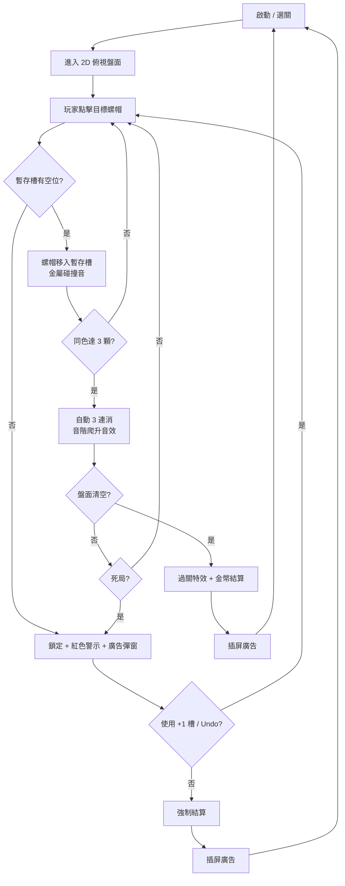

# SCREWCOLOR 完整規格書 (GDD Full - 10 分頁對齊版)
> 開發商：ABI GLOBAL LTD. / ABI Game Studio（越南）
> 分析基礎：App Store 截圖、玩法影片、逆向機制推測

---

## Tab 1 - 遊戲規則 (Game Rules)

### 核心操作
- 操作模式：單指點擊，螺帽移入暫存槽，同色達 3 顆自動觸發消除飛入收集盒。
- 2D 俯視視角，無 3D 空間旋轉，降低空間思考門檻。
- 螺帽 Hitbox 膨脹 130%，防止密集盤面誤觸。

### 核心規則
- 螺帽只能進入顏色相同的收集盒（系統自動配對）。
- 暫存槽固定格數（5~7 格），所有格子滿載且無法 3 連消 = 死局。
- 被遮蓋的螺帽（灰化顯示）無法被點選，需先移除上層。

### 勝敗條件
- 勝利：盤面所有螺帽清空。
- 失敗：暫存槽滿載且無合法消除組合，或用盡所有撤銷機會。

### 容錯設計
- Undo：每局 3 次免費，耗盡後看廣告。
- +1 暫存槽：最強道具，激勵廣告限定（每局 2 次）。
- 清除指定色：高階 IAP 道具。
- 無時間限制：輕鬆無壓定位。

---

## Tab 2 - 主題包裝 (Theme & Meta Story)

### 世界觀
- 表層主題：五金工具 / 工業零件整理。比液體藥水更硬核，比 3D 拆解更扁平可親。
- 橋接型商業定位：卡在 Magic Sort 和 Screwdom 3D 之間的受眾空白地帶。

### 情感鉤子
- 整理 OCD：混亂轉有序的視覺滿足感。
- 3 連消驚喜感：系統自動觸發而非玩家預期，意外多巴胺釋放率更高。
- 金屬滑動 ASMR：碰撞質感音效。

### 挫折設計
- 暫存槽三色警示（藍→黃→紅）不需文字即可傳達壓迫感。
- Pity System：70% 死局差一個槽位，廣告點擊阻力最低。

---

## Tab 3 - 流程圖 (Game Flow)

---

## Tab 4 - 遊戲介面 (UI Layout)

### 主要面板（1080x2340）
- 頂部 HUD（Y: 0~160px）：關卡編號、進度條、設定
- 主盤面（Y: 160~1700px）：2D 俯視混色螺帽堆（主操作區）
- 暫存槽列（Y: 1700~1950px）：5~7 個暫存格，三色警示狀態
- 收集盒列（Y: 1950~2200px）：顏色分類收集盒
- 道具欄（Y: 2200~2340px）：Undo、+1 槽、清除道具

### 觸控設計
- 螺帽 Hitbox 膨脹 130%，防止密集盤面誤觸。
- 暫存槽格子視覺放大，讓玩家隨時清楚知道剩餘格數。
- 道具欄落在大拇指黃金操作區（Y 軸最底部）。

---

## Tab 5 - 美術靜態開圖 (Static Art Specs)

素材 / 類型 / 建議尺寸 / 備註
- 螺帽本體：2D Sprite，128x128px @3x，各色共用形狀，以 Color Tint 區分
- 螺帽高光層：Alpha Sprite，128x128px @3x，固定白色高光統一受光感
- 暫存槽底板：9-Slice，192x192px @2x，正常灰 / 警告橙 / 滿載紅三態
- 收集盒：9-Slice，256x256px @2x，顏色對應螺帽，顯示收量數字
- 盤面背景：靜態圖，1080x2340px @1x，工業木桌感低飽和
- UI 按鈕：Sprite Atlas，128x128px @3x，全部合批入 ui_atlas.png

---

## Tab 6 - 美術動態開圖 (Animation Specs)

動畫 / 觸發 / 實作 / 時長
- 螺帽選中浮起：點擊，Scale 1.0→1.15 + 陰影放大，0.1s
- 移入暫存槽：確認移動，拋物線 Lerp + 落定 Squash，0.25s
- 3 連消飛出：同色達 3 顆，Bezier 飛入收集盒，0.3s
- 暫存槽警示閃爍：剩餘 1 格，Alpha 閃爍 0.5s 週期，循環
- 收集盒完成封口：某色全清，發光 + 打勾淡入，0.5s
- 過關全清爆散：所有螺帽消除，星光粒子爆散 + 金幣飛出，1.0s

幀率目標：60fps，Draw Call ≤ 30 次，Overdraw ≤ 2 層。

---

## Tab 7 - 道具功能 (Item / Power-up System)

道具 / 取得 / 功能 / 限制 / 成本
- Undo：免費 / 廣告，撤回最後一顆螺帽，每局 3 次免費，耗盡看廣告
- +1 暫存槽：激勵廣告，新增一個暫存格，每局 2 次，30 秒廣告（不可買幣）
- 清除指定色：高階 IAP，清除盤面單一顏色全部，每局 1 次，高單價
- 洗盤 Shuffle：金幣 / 廣告，重排盤面螺帽，每局 1 次，約 300 金幣

---

## Tab 8 - 機關物件 (Obstacle & Special Objects)

機關 / 出現條件 / 效果 / 解除
- 標準彩色螺帽：所有關卡，可直接點擊，直接點擊
- 遮蓋層 (Blocked)：中高關卡，灰化無法取，先移除上層
- 鎖定螺帽 (Locked)：高關卡，需消除相鄰同色才解鎖，消除周圍特定顏色
- 冰凍螺帽 (Frozen)：部分版本，需達成指定消除數解除，累積消除數

DDA 節點：
- 前 30 關：4 色 / 7 格暫存，無遮蓋
- 31~80 關：6 色 / 5 格，引入遮蓋層
- 81 關以上：8 色以上 + 鎖定 + 冰凍，Kill Switch 在連過 4 關後觸發

---

## Tab 9 - 美術風格資料 (Art Style Guide)

### 整體風格
擬真 2D 金屬感：高對比金屬材質貼圖（非純色平塗），底層仍是 2D Sprite 保持效能。

### 主色盤
- 盤面背景：工業木桌暖棕，HEX #4A3728
- 螺帽紅：HEX #E83535
- 螺帽藍：HEX #3A7AE8
- 螺帽黃：HEX #F5C518
- 螺帽綠：HEX #3ACA6A
- 螺帽紫：HEX #8B3AE8
- 暫存槽警告橙：HEX #FF6B00
- 暫存槽滿載紅：HEX #FF2020

### 光影系統
- Baked Highlight（烘焙高光）：左上 45° 統一受光，所有顏色視覺一致。
- 無即時光照：渲染成本等同 Unlit Shader。

### 渲染策略
- Shader：Unlit 底色 + Alpha 混合高光層
- 材質壓縮：iOS ASTC 6x6；Android ETC2
- Draw Call 目標：≤ 30 次 / 幀（全 Sprite Atlas 合批）

---

## Tab 10 - 音樂音效需求 (Audio Requirements)

### BGM
- 風格：輕快機械工廠感，鐵琴或馬林巴主旋律，BPM 105~115
- 情緒層：平常輕快 → 槽快滿時張力弦樂 → 3 連消短旋律 → 過關勝利旋律

### SFX
- 螺帽選中：輕金屬「叮」，無 Pitch，短促清脆
- 移入暫存槽：金屬滑動「喀」，無 Pitch，ASMR 核心
- 3 連消觸發：清脆爆鳴，每 Combo +0.5 音階，多巴胺核心
- 暫存槽警告：低頻「嗶」，無 Pitch，配合紅框閃爍
- 死局鎖定：沉重「咚—」，無 Pitch，全 UI 變暗同步
- 過關全清：4~8 拍勝利旋律，無 Pitch，情緒釋放最高點

### 技術規格
- 總預算：≤ 12MB
- 格式：BGM AAC 128kbps；SFX OGG Vorbis Q6
- Audio Pooling：最多 6 個聲源，超量 Cull 最舊聲源
- 響度標準：-14 LUFS 標準化

---

## 附錄：三款競品關鍵差異對比

| 維度 | Magic Sort | Screwdom 3D | SCREWCOLOR |
| :--- | :--- | :--- | :--- |
| 空間維度 | 2D 試管垂直 | 3D 旋轉模型 | 2D 俯視盤面 |
| 操作模式 | 二段點擊傾倒 | 點擊 + 3D 旋轉 | 點擊移入暫存槽 |
| 消除觸發 | 手動湊滿 | 手動全拆完 | 自動 3 連消 |
| 核心壓力 | 試管容積 | 拓撲卡死 | 暫存槽格數 |
| Meta 深度 | 強（煉金塔） | 弱 | 弱~中 |
| ASMR 核心 | 液體傾倒聲 | 金屬旋轉咔噠 | 金屬碰撞滑動 |
| Hitbox 膨脹 | 120% | 140% | 130% |
