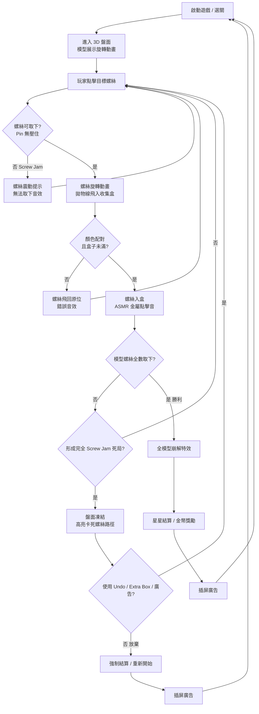

# Screwdom 3D 規格書 - 01. 系統與經濟拆解
> 分析基礎：Screw Jam 螺絲拆解機制、App Store 評測、逆向數值推測
> 負責人：Game Designer AI

## 1. 核心玩法概要 (Gameplay Overview)
- **盤面基底**：一個由多顆彩色螺絲固定的 3D 幾何模型（房屋、動物、方塊等），搭配底部數個顏色分類收集盒（Color-coded Box）。
- **基礎行為**：點擊 3D 模型上的螺絲，螺絲自動旋轉鬆開並以拋物線飛入對應顏色收集盒。玩家可隨時滑動旋轉整個 3D 模型以觀察被遮擋的螺絲。
- **物理容積限制**：每個收集盒有固定上限（約 6~10 顆）。盒子滿載時，即使螺絲顏色正確也無法繼續取下。
- **轉移規則**：螺絲只能進入顏色相同的收集盒；若目標螺絲的 Pin 被其他結構件壓住（Screw Jam），無法強制取下。
- **勝敗條件**：
  - **勝利**：3D 模型上所有螺絲全數移除，結構件分離崩解，播放過關動畫。
  - **失敗 / 死局**：所有剩餘螺絲均形成 Screw Jam 且收集盒滿載，進入無法操作的死局狀態。

## 2. 遊戲核心與外圍流程 (Game Flow)

## 3. 操作邊界與極限反饋（0-30 秒）

### 3.1 輸入 / 輸出映射與防呆 (Hitbox)
- **3D Hitbox 膨脹**：螺絲頭的可點擊區域需膨脹至視覺面積的約 140%，補償手機觸控在 3D 空間的 Z 軸深度誤判問題（3D 遊戲比 2D 的誤觸率更高）。
- **旋轉手勢優先級**：點擊螺絲（Tap）與旋轉鏡頭（Swipe）的手勢識別需設定最小移動閾值（約 8~12px），避免想旋轉卻誤觸螺絲。
- **旋轉慣性 (Momentum)**：甩動後 Camera 繼續旋轉約 0.3~0.5 秒再停止，增加 3D 空間感的實體質感。

### 3.2 單次行動反饋
- **視覺**：螺絲旋轉鬆開配合沿 Pin 軸的上升位移 Tween、拋物線飛行、落入盒子縮放動畫三段式回饋。
- **聽覺**：金屬「咔噠」旋轉聲（ASMR 核心），配合入盒時清脆「叮」聲；連續入盒時 Pitch 上升 0.3 音階。
- **錯誤防呆**：Screw Jam 狀態下的螺絲快速左右震動（Shake），完全取代文字提示，告知玩家此路不通。

## 4. 單局目標層次與留存鉤子（5-15 分鐘）

### 4.1 目標與難度生成
- **核心解謎依賴**：拓撲排序（Topological Sort）邏輯。玩家需在腦中建立「哪個 Pin 上的螺絲最先被清空，才能讓後續的 Pin 被解放」的依賴關係圖。
- **難度生成公式 (DDA)**：
  - 前 20 關：所有螺絲初始即可見，無隱藏；依附件少，Screw Jam 機率低。
  - 21~60 關：引入 3D 背面隱藏螺絲，模型複雜度上升。
  - 60 關以上：大量依附件組合拳，系統保留 Pity System（瀕死時 70% 機率的下一步為合法操作）。

### 4.2 死局與心流中斷
- Screw Jam 發生後，系統不立刻強制結算，而是高亮顯示卡死的螺絲路徑讓玩家「看清楚自己哪裡拆錯」，觸發強烈懊悔感。
- **挫折變現點**：此時 Extra Box（最強道具）的廣告彈窗轉換率達到全局最高峰。

## 5. 逆向經濟與數值控制模型

### 5.1 核心經濟循環 (Sources & Sinks)
- **產出 (Sources)**：過關獲得金幣（觀看廣告可翻倍）、限時活動獎勵。
- **消耗 (Sinks)**：購買 Undo、Extra Box、Hint 道具；解鎖新 3D 模型皮相（輕量 Meta）。

### 5.2 道具體系與定價暗流
- **Extra Box（擴充收集盒）**：破壞力最強的道具，等同 Magic Sort 的 +1 空瓶。被嚴格限制為必須觀看 30 秒激勵廣告才能取得（不可直接以金幣購買），死死卡住最高 ARPU 的變現錨點。
- **Undo**：每局 3 次免費；耗盡後每次消耗約 100~150 金幣，持續削空玩家庫存。
- **IAP 策略**：從廣告為主逐步轉向 IAP First，月卡訂閱涵蓋無限 Undo + 限定皮相。

## 6. 廣告與 IAP 商業化節點
- **強插屏邏輯**：每過 1~2 關的結算畫面後，強制彈出 15 秒不可跳過插屏廣告。
- **激勵廣告核心**：Extra Box 與 Undo 的廣告轉換是最高單價版位。
- **去廣告 IAP**：提供單次付費移除插屏廣告的方案，保留激勵廣告讓玩家自願觀看。
