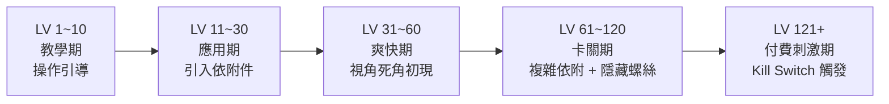

# Screwdom 3D 規格書 - 02. 關卡與空間分析
> 分析基礎：Screw Jam 拓撲排序、3D 空間盲區設計、難度節奏光譜
> 負責人：Level Designer AI

## 1. 關卡節奏光譜 (Pacing Spectrum)



### 各階段說明
- **教學期（LV 1~10）**：所有螺絲初始即可見，依附件數量極少，保證玩家能在任意順序完成關卡。目的是建立「點擊即成功」的正向反饋閉環。
- **應用期（LV 11~30）**：引入第一個依附件（Bracket），玩家開始意識到「拆錯順序會導致卡死」。此階段 Undo 的使用頻率開始爬升。
- **爽快期（LV 31~60）**：加入背面隱藏螺絲（需旋轉視角才能發現），螺絲數量顯著增加，但仍保留充足的操作自由度，玩家進入心流最深的黃金帶。
- **卡關期（LV 61~120）**：複雜依附件組合 + 多層隱藏螺絲，死局機率大幅上升。Extra Box 廣告轉換率達到全生命週期最高峰。
- **付費刺激期（LV 121+）**：DDA 系統在玩家連續通關後觸發 Kill Switch，強制派發複雜度最高的模型配置，主動製造死局以引發 IAP 購買衝動。

## 2. 空間盤面與動線設計

### 2.1 3D 模型空間分區
- **正面區（0°~90° 視角）**：永遠放置最多數量的可見螺絲，減少新手玩家旋轉視角的需求。
- **側面區（90°~180° 視角）**：中關卡起放置少量隱藏螺絲，引導玩家習慣旋轉操作。
- **底部 / 背部區（180°~360° 視角）**：高關卡的核心卡點來源，往往放置解開死局的「關鍵 Pin」。

### 2.2 依附件下垂的動線防呆機制
- 當玩家移除某根螺絲後，依附在同一 Pin 上的結構件會自動下垂，**視覺上清楚暴露**已被解鎖的 Pin 末端，引導玩家注意下一步操作方向。
- 若下垂的結構件剛好擋住另一顆螺絲，系統會將無法操作的螺絲高亮變暗（Dimming），即時告知玩家「這顆先不能碰」。

### 2.3 觸控盲區（1080x2340 實體操作分析）
- 大拇指在 Y 軸 1800px 以上區域（上方 77%）操作時，手指本體會遮擋 3D 模型的下半部螺絲。
- **解法**：系統在玩家長時間未旋轉視角時，輕微晃動模型（Hint Animation），提示玩家旋轉查看被遮擋區域。

## 3. 難度節點與數值設計

### 3.1 關鍵數值邊界參考
```
初始螺絲數量（教學）：    6~10 顆
初始螺絲數量（中期）：    14~22 顆
初始螺絲數量（高期）：    24~40 顆以上
收集盒數量（標準）：      3~5 個盒子
收集盒容量（標準）：      每盒 6~10 顆
DDA Pity 觸發條件：       瀕死時合法操作機率提升至 ~70%
Kill Switch 觸發條件：    連續通關 5 關後派發高難度模型
```

### 3.2 關卡生成邏輯（逆向推測）
- Screwdom 3D 的關卡**不採用純隨機生成**。所有關卡均從「已完成清空狀態」由程式反向推算加入螺絲與依附件，確保關卡擁有絕對解（至少一條合法拆解路徑）。
- 高難度關卡通常只設計**唯一的最優解順序**，強迫玩家必須精確規劃，容錯率極低。

## 4. 關卡多樣性設計

### 4.1 模型主題輪換（皮相系統）
- 每隔 10~20 關切換一個 3D 模型主題（如：紅磚房 → 黃色小鴨 → 老式汽車），維持視覺新鮮感不重複。
- 模型複雜度與螺絲層次深度對應當前關卡難度區間，皮相與難度同步升級。

### 4.2 限時特殊事件關卡
- 週末活動關卡：特定主題模型（節慶款）搭配高倍金幣獎勵，刺激非活躍玩家回流。
