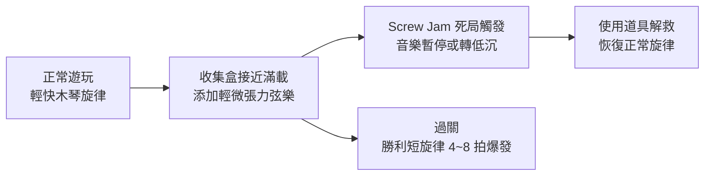

# Screwdom 3D 規格書 - 03. 聽覺反饋擷取
> 分析基礎：ASMR 金屬音設計、Pitch Shifting 連消音階、音訊記憶體預算推測
> 負責人：Audio Engineer AI

## 1. 音樂設計 (BGM)

### 1.1 整體情緒定調
- **風格**：輕快工業機械感，主旋律以木琴或鋼片琴為主，避免過重的電子音效以維持放鬆氛圍。
- **BPM**：約 100~120 BPM，讓玩家在無意識狀態下保持穩定的操作節奏。
- **循環點設計**：於第 8 拍或第 16 拍的強拍換段，確保無縫 Loop （玩家長時間遊玩不會注意到音樂重複）。

### 1.2 動態情緒層次


## 2. 核心音效設計 (SFX)

### 2.1 ASMR 金屬音效系列（核心競爭力）
Screwdom 3D 的最大差異化在於「真實金屬機械感音效」。每一個音效均以高擬真度的金屬錄音為基礎後製：

- **螺絲旋轉鬆開**：六角金屬螺帽旋轉時的高頻「咔噠咔噠」機械聲，每一圈旋轉約播放 2~3 個連續點擊音，配合螺絲視覺旋轉圈數同步。
- **螺絲飛行中**：輕微的空氣切割「咻」聲（低音量），製造金屬物件飛行的速度感。
- **螺絲入盒**：清脆的金屬碰撞「叮」聲，語氣短促有力。這是核心多巴胺觸發點。

### 2.2 Pitch Shifting 連消音階設計（多巴胺駭客）
- 連續成功將螺絲入盒時，每一顆入盒音效的音調自動上升 **+0.3 個半音階**。
- 當同一顏色的收集盒在短時間內連續收到 3 顆以上螺絲時，額外觸發一個「收集盒滿足音效」（Completion Chime），音調比最後一顆入盒音再高 1 個完整音階，作為多層次的聽覺獎勵峰值。

```
入盒第 1 顆：Do（基準音）
入盒第 2 顆：Re（+0.3 半音）
入盒第 3 顆：Mi（+0.6 半音）
收集盒裝滿：高八度 Do（頂峰獎勵音）
```

### 2.3 錯誤與挫折音效
- **Screw Jam 卡死**：低沉的「嗯—嗯—嗯」金屬受阻聲，語氣沉重，配合螺絲震動動畫。刻意設計為比正常入盒音「更暗、更悶」的對比感，強化玩家的挫敗情緒。
- **收集盒滿載拒絕**：短促的「叩」拒絕音，音色類似金屬碰到硬壁的反彈聲。

### 2.4 特殊事件音效
- **全模型崩解（過關）**：爽快的金屬螺絲彈飛、結構件碰撞散落的複合音效（多層次音效疊加），持續約 1.5 秒，是全局最高能量的聽覺爆發點。
- **使用 Extra Box**：魔法式的「嗖—」生成音，清脆有力，對比死局的慘淡氛圍形成情緒逆轉。
- **使用 Undo**：快速的倒退「唰—」音效，清晰傳達「時間倒流」的操作感。
- **死局觸發凍結**：低沉的「嗡—」下滑音效，配合畫面凍結的 2 秒懊悔時間（情緒勒索核心節點）。

## 3. 技術規格與記憶體預算

### 3.1 音訊資源預算
```
預估 BGM 體積：      約 4~6MB（AAC 128kbps，3~4 分鐘循環）
預估 SFX 總體積：    約 10~14MB（OGG Vorbis Q7，高頻金屬音）
總音訊預算上限：     ≤ 20MB
```

### 3.2 技術實作細節
- **同時播放聲源上限**：最多 8 個 Audio Source 同時播放，超過時自動 Cull 最舊、音量最低的聲源，防止音頻堆疊爆音。
- **Audio Pooling**：入盒音效的 Pitch 變化採用單一 Audio Source + Runtime Pitch 修改實現，不需為每個音階載入獨立音頻文件，確保記憶體效率。
- **Audio Occlusion**：不需要（2.5D 視覺風格，無真實空間遮擋模擬需求）。
- **壓縮格式**：
  - BGM：AAC 128kbps（iOS）/ OGG 128kbps（Android）
  - SFX：OGG Vorbis Q7（金屬音需保留更多高頻泛音，Q6 以下高頻會明顯失真）

### 3.3 ASMR 品質保障
- 螺絲旋轉音效必須以 **44.1kHz / 24-bit** 規格錄製原始素材，再壓縮輸出，確保在高端手機上播放時金屬質感不失真。
- 所有音效在壓縮前，需通過 **-14 LUFS** 整體响度標準化（Loudness Normalization），避免不同音效的音量落差過大影響 ASMR 體驗。
